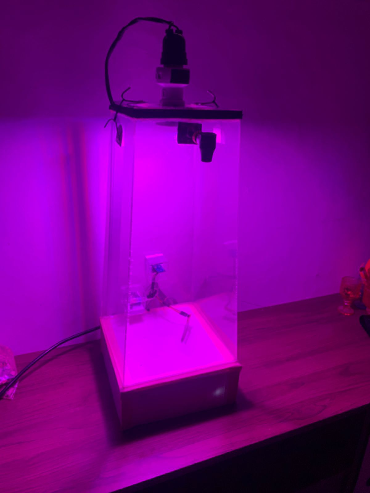

# 🌱 Estufa Inteligente  
### Sistema de Monitoramento, Controle e Simulação de Atmosferas

---

## 📌 Sobre o Projeto

A **Estufa Inteligente** é um sistema desenvolvido para monitorar, controlar e simular diferentes condições ambientais em plantas em estágio inicial.

O objetivo do projeto é simular diferentes atmosferas para analisar como as plantas se comportam em possíveis cenários futuros, permitindo estudos sobre adaptação e impacto ambiental.

---

## 🏆 Trajetória

- 🥇 1º lugar — Etapa Regional (SEFOR1)  
- 🔬 Classificado para a fase estadual — Ceará Científico  

---

## ⚙️ Funcionalidades

### 📡 Monitoramento em tempo real
- 🌡️ Temperatura  
- 💧 Umidade do ar  
- 🌱 Umidade do solo  
- ☀️ Luminosidade  
- 🌫️ Qualidade do ar  

---

### 🤖 Controle do ambiente
- 💦 Sistema de irrigação automática  
- 💡 Controle de fotoperíodo  
- 🌬️ Injeção de CO₂  

---

### 📊 Visualização de dados
- Dashboard com atualização em tempo real  
- Gráficos dinâmicos com Chart.js  
- Análise dos dados por hora  

---

## 🧠 Tecnologias Utilizadas

- ESP32  
- Sensores (DHT11, BH1750, umidade do solo, MQ-135)  
- Ubidots (plataforma IoT)  
- HTML, CSS e JavaScript  
- Chart.js  

---

## 📁 Estrutura do Projeto
```
/projeto
│── index.html
│── style.css
│── script.js
│
│── graficos.html
│── graficos.css
│── graficos.js
```

---

## 📊 Diferenciais
- Integração com IoT em nuvem
- Processamento de dados por hora
- Separação entre monitoramento em tempo real e análise histórica
- Sistema completo de monitoramento e controle ambiental

## 🌍 Aplicações
- Agricultura inteligente
- Pesquisa científica
- Monitoramento ambiental
- Ensino de IoT e robótica

---

Projeto desenvolvido com foco em robótica, IoT e análise ambiental.
